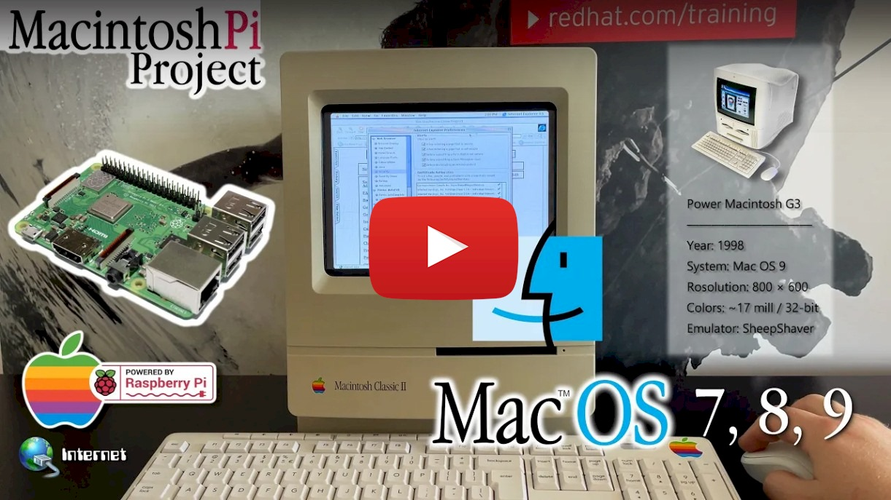
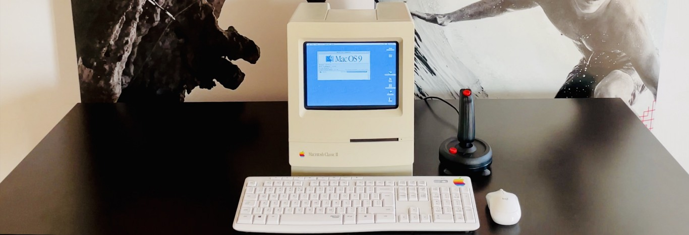

# MacintoshPi

MacintoshPi is a small project that allows running full-screen versions of Apple's *Mac OS 7*, *Mac OS 8* and *Mac OS 9* with sound, active Internet connection and modem emulation under *Raspberry Pi*. All this without the X.org manager, only a multimedia SDL2 library and from the CLI / *Raspberry Pi OS (Legacy)*. This lets emulators use full power of *Raspberry Pi*, making them more stable and useful in combination with additional retro-software. Installation requires running a single script on a clean *Raspberry Pi OS (full) Legacy* and waiting about two hours for the packages to compile and install. In addition, thanks to a document contained in the project, it is possible in dual-boot to place the fastest (bare-metal) *Commodore 64/128/PET* emulator **BMC64**, thus building an interesting retro package on a single SD card. The entire *MacintoshPi* project runs on **Raspberry Pi Zero 2 W**, **2**, **2B**, **3**, **3B**, **3A+**, **3B+** (at present, it does not run on version 4).

Below you will find a short clip showing what MacintoshPi can do:

<p align="center"><a href="https://www.youtube.com/watch?v=J2kgQuUPLoY" target="_blank"></a></p>

A much longer version of the clip can be [found here](https://www.youtube.com/watch?v=yDPkjhl2oSI).

## Project components

The project consists of the following auto-compiling and installing bash scripts for Raspberry Pi:

* Macintosh 68K emulator **[Basilisk II](https://basilisk.cebix.net)** supporting Mac OS 7 (System 7.5.5) and Mac OS 8.
* PowerPC emulator **[SheepShaver](https://sheepshaver.cebix.net)** supporting Mac OS 9.
* A development library **[SDL2](https://www.libsdl.org)** designed to provide low level access to audio, keyboard, mouse, joystick, and graphics hardware.
* Commodore 64/128/PET emulator **[VICE](https://vice-emu.sourceforge.io)**.
* **[MacintoshPi Virtual Modem](https://github.com/jaromaz/MacintoshPi#macintoshpi-virtual-modem)** using the **[tty0tty](https://github.com/freemed/tty0tty)** and **[tcpser](http://www.jbrain.com/pub/linux/serial/)** projects, running with the two aforementioned emulators for *Apple* and *Commodore* products, and on *Raspberry Pi OS* itself, as well as allowing any original terminal retro-software to connect with modern-day telnet BBSs.
* CD-ROM, DVD-ROM emulator **[CDEmu](https://cdemu.sourceforge.io)** which allows mounting CD images (iso, toast, cue/bin, mds/mdf etc.) under *Raspberry Pi OS* - runs with *BasiliskII* and *SheepShaver* emulators, as well as on *Raspberry Pi OS*. The emulators are configured automatically to support that virtual CD-ROM drive.
* A consistent **[MacintoshPi Launcher](https://github.com/jaromaz/MacintoshPi#macintoshpi-launcher)** that runs all of those systems at different resolutions (after reboot), in different configurations, with autostart support and with various startup chimes.
* **[SyncTERM](https://syncterm.bbsdev.net)** - an application for connecting with BBSs from the *Raspberry Pi OS*, compiled in combination with the *SDL library*.
* Information how to run *Raspberry Pi OS* in **dual-boot** with **[BMC64](https://accentual.com/bmc64/)**, the fastest *Commodore* emulator for *Raspberry Pi* (bare metal/low latency emulator).

**Mac OS images** are pre-configured to support online connections.

Apple-1, Apple ][, Altair and IMSAI emulators moved to the new [DinosPi](https://github.com/jaromaz/DinosPi) project.

Special thanks to [Christian Bauer](https://www.cebix.net) and [kanjitalk755](https://github.com/kanjitalk755).


## Installation

The project must be installed on a clean, full *Raspberry Pi OS (oldold Legacy) Buster image* [2022-04-04-raspios-buster-armhf.img.xz](https://downloads.raspberrypi.org/raspios_oldstable_armhf/images/raspios_oldstable_armhf-2022-04-07/2022-04-04-raspios-buster-armhf.img.xz) - you must switch to command line or set system start to CLI (Start -> Preferences -> Raspberry Pi Configuration : *To CLI* and *Wait for network* checked). The installation process requires a minimum 16 GB SD card.

Installation of the entire *MacintoshPi* package requires running the single command ```./build_all.sh``` - all dependencies and required packages will be installed automatically:

```
git clone https://github.com/jaromaz/MacintoshPi
cd MacintoshPi
./build_all.sh
# That's it - now you can run, for example, Mac OS 9:
mac os9
```

The process of compiling and installing packages can take about two hours.

Each of these sub-projects can be installed separately by running the corresponding compilation & installation script contained in the directory relevant to the sub-project concerned. The installation scripts must be run from the ```pi``` user.

## Detailed descriptions of MacintoshPi project components

### Basilisk II (Mac OS 7 and 8) and SheepShaver (Mac OS 9)

The script downloads all files required to start Mac OS - ROMs, system images, and creates configuration files. On installation, directory ```/home/pi/Downloads``` will be visible on the Apple desktop as a ```Unix``` directory - files can be copied both ways between those two resources, but applications cannot be launched directly from that directory. In addition, the so-called *NetDriver* is also compiled, which allows full online access from virtualised *Apple* systems.
Up till now, *Mac OS 9* in the full screen mode (without the unnecessary window manager) has not been available for *Raspberry Pi*. This is perhaps the first such implementation which allows using *Mac OS 9* and SDL2 in the full screen mode with sound and online connection - even on the small *Raspberry Pi 2W*.
Each system must be launched with the appropriate command: ```mac os7```, ```mac os8``` or ```mac os9```. The additional file ```.img``` or ```.dsk``` can be added to the launched system by adding the image file name at the end of the command which invokes the system concerned, e.g.

```mac os9 demo.img```

*Basilisk II* and *SheepShaver* emulators can be stopped by using the key combination *CTRL+SHIFT+ESC*. This causes an immediate return to the command line. The *COMMAND* key is acquired with the left *ALT* key in *Mac OS 9*, and with the *CTRL* key in *Mac OS 7* and *Mac OS 8*.
For more information about those emulators visit the [BasiliskII](https://basilisk.cebix.net) and [SheepShaver](https://sheepshaver.cebix.net) websites.


### VICE

The script that compiles the **VICE** *Commodore* emulator which can be used for connecting an emulated *Commodore* with modern BBSs. It allows downloading files which can be used on the same *Raspberry Pi* device, but on the fast *BMC64* emulator installed in dual boot. On installing the *BMC64* partition to *rootfs*, data can be downloaded from a BBS directly to the virtual drive that will then be available automatically in *BMC64*. The *VICE* emulator for *Raspberry Pi* is very slow, which is why it is recommended to use the *BMC64* emulator for more demanding applications. For more information about the *VICE* emulator visit the [project's website](https://vice-emu.sourceforge.io).

### MacintoshPi Virtual Modem

A script that compiles and installs a virtual modem in *Raspberry Pi OS*, allowing connection with modern-day telnet BBSs using any terminal software launched on the aforementioned *Basilisk II*, *SheepShaver* and *VICE* emulators, and on *Raspberry Pi OS* itself.
The *MacintoshPi Virtual Modem* is controlled by systemd and uses the *tpcser* software which, through the *tty0tty* project, writes to virtual device ```/dev/tnt0```. The data can be read from another virtual device ```/dev/tnt1```, which thus becomes a virtual serial port in the system. The modem launches by default after the system boots.

It can be reset or paused with the standard systemd commands:

```sudo systemctl stop vmodem```

```sudo systemctl reset vmodem```

Speed (bps) change options can be set in the configuration file as per example entries provided with it:

```/etc/vmodem.conf```

To connect with a telnet BBS, just run the following command on terminal application:

```ATDT telnet_url:port```

For example:

```ATDT borderlinebbs.dyndns.org:6400```

The virtual modem cooperates with the **VICE** *Commodore 64* emulator, but only with a version launched with the ```x64sc``` file.


#### Modem speeds depending on emulation

| System                   | Maximum speed bps       |
|--------------------------|:-----------------------:|
| Commodore / VICE         |          2400           |
| Mac OS 7-8 / BasiliskII  |          28800          |
| Mac OS 9 / SheepShaver   |          28800          |
| Raspberry Pi OS          |          38400          |

### Configuring a virtual modem

* In VICE Commodore 64, run command *x64sc* and select: *F12* -> *Machine settings* -> *RS232 Settings*:
  Set the screen as per the figure below, also marking appropriate dots in green with:

  <p align="center"></p>

* In *Basilisk II* and *SheepShaver*, configuration is already performed automatically in their configuration files. In Apple terminal application, just select the standard serial port and modem speed as set under Raspberry Pi OS in file ```/etc/vmodem.conf``` (default 2400 bps).
* In terminal applications directly under *Raspberry Pi OS* (e.g. *minicom*), just indicate the serial port: ```/dev/tnt1``` and speed as shown in file ```/etc/vmodem.conf```.

### CDEmu

A script which compiles the **CDEmu** CD/DVD emulator, allowing mounting CD and DVD images in *iso*, *toast*, *cue/bin*, *mds/mdf* and many other formats. The application is similar to **Daemon Tools** for Windows and runs with *BasiliskII* and *SheepShaver* as well as on *Raspberry Pi OS*. It allows you to create an image of an old CD-ROM, copy it to *Raspberry Pi* and install software from it in an Apple system emulated on *Raspberry Pi*. 
It is no longer necessary to copy *.toast* files to the disk image or mount them with software for *Mac OS* - you can now unpack a *.sit* file under *Raspberry Pi OS* using the ```unar``` command, and then mount the unpacked *.toast* file also under *Raspberry Pi OS* using the ```cdload``` command, and use the CD image on any *Mac OS* as you would from a regular CD-ROM. Audio CDs launched in *CDEmu* run correctly in *Raspberry Pi OS* both in the graphic and text mode, but sound does not work in the *Basilisk II* or *SheepShaver* emulators. For more information about *CDEmu* visit the [project's website](https://cdemu.sourceforge.io).

A CD image can be easiest mounted using the command:

```cdload image.toast```

The CD will be available in the virtual device:

```/dev/sr0```

The image can be unloaded from the virtual device using the command:

```cdunload```

### MacintoshPi Launcher

The maximum emulator performance is achieved in the native resolution of the emulated system, i.e. it is recommended that *Raspberry Pi* should start in e.g. 640x480 resolution if we want to launch *Mac OS* in 640x480 resolution on it.

The launcher's task is to launch a given version of *Mac OS*, and if one is already running with appropriate parameters, then to overwrite ```config.txt``` and any other system files with the appropriate screen resolution and position assigned to a specific system or any other defined application, and then to launch the emulator or application right after a system restart, this time in the new resolution.

The name of the directory with the data with which the system is to be overwritten is identical as the name of the parameter following the ```mac``` command, e.g. ```mac os8-480``` will restart *Raspberry Pi OS* in 640x480 resolution, and then launch *Mac OS 8* also in that resolution, but the ```mac os8``` command will simply launch *Mac OS 8* in the most recently selected resolution.

Various startup chimes are played at the launch of each system - depending on the selected resolution: Macintosh 128K, Macintosh Classic II, Macintosh Color Classic, Macintosh Performa 520, Power Macintosh 550, Power Macintosh G3 sounds.

The Launcher allows also ```.img``` or ```.dsk``` files to be added to *Mac OS* using e.g. ```mac os7 file.img``` - then the *Mac OS* concerned will be launched and the image content will appear on the desktop as an additional drive.

### SyncTERM

It is currently the best application for connecting with modern-day BBSs using the telnet protocol. It is compiled with options which use the *SDL* graphic library, thanks to which it uses a wide selection of appropriately adapted fonts in the graphic mode rather than system fonts. Again, SyncTERM does not require *X.org* to run, and the program itself launches in the full screen mode by default.

### Raspberry Pi OS dual-boot

Information about the possibility to launch *Raspberry Pi OS* in *dual boot*, along with **BMC64**, the fast *Commodore emulator*, is contained in a separate [README dual-boot](dual-boot/README.md).

### How to install additional software

Software for *Mac OS 7*, *Mac OS 8* and *Mac OS 9* can be found on the following websites:

- [Macintosh Garden](https://www.macintoshgarden.org)
- [Macintosh Repository](https://www.macintoshrepository.org)
- [mac.org](http://www.mac.org)
- [The Macintosh Archives](http://websites.umich.edu/~archive/mac/)
- [Macintosh Archive](https://mirror.macintosharchive.org)
- [Mac GUI](https://macgui.com/downloads/?cat_id=56)

These websites can be used comfortably in the *Chromium* browser directly in *Raspberry Pi OS* - downloaded files are saved by default in directory ```/home/pi/Downloads```, which is configured as a shared directory for all *Mac OSs* contained in this project - under *Mac OS*, it is displayed as a *Unix drive*.

Although not every downloaded app will run in the *Basilisk II* or *SheepShaver* emulation (this is the case with e.g. OpenGL applications), the vast majority will run correctly. Before downloading, make sure that the software is from the abandonware group or purchase the required licence if still possible.

There are three methods to install the software, depending on the type of the file downloaded:

1. The file downloaded has the ```.sit``` extension and contains either a ```.toast``` or ```.iso``` CD image:

   unpack the file under *Raspberry Pi OS* using the ```unar file.sit``` command; remove any spaces from the name of the unpacked ```.toast``` file (if there are any), and then mount the ```.toast``` file using the ```cdload file.toast``` command. Next, launch a given *Mac OS* version and install the software from the virtual CD drive that will be displayed on the desktop.

2. The file downloaded has either the ```.sit``` or ```.zip``` extension, and contains an ```.img``` or ```.dsk``` file:

   unpack the file under *Raspberry Pi OS* using either the ```unar file.sit``` or ```unzip file.zip``` command; remove any spaces from the unpacked ```.img``` or ```.dsk``` file and launch a given ```Mac OS``` using the ```mac os7 file.img``` command - then the image will be automatically added to the system and will appear as an additional drive on the desktop.

3. The file downloaded has the ```.sit``` extension, and contains software dedicated directly to *Mac OS*:

   first download an image of ```Stuffit Expander``` app and install this software in ```Mac OS```; next, take the ```.sit``` file proper originally downloaded to the ```Downloads``` directory and copy it, already in *Mac OS*, from the ```Unix``` directory to the *Macintosh HD* virtual drive and double click the file to unpack it directly in *Mac OS*.

### About my Macintosh Classic II



My version of MacintoshPi is driven by *Raspberry Pi 3B+*. I bought my *Macintosh Classic II* case on eBay - it was completely yellow, but I restored it to the factory condition by means of 18% hydrogen peroxide and appropriate light exposure.
Its *LCD IPS 10.1’’ 1024x600px HDMI Waveshare 11870* screen is turned 180°, so that the wiring does not interfere with the upper Macintosh frame. I filled up the space between the flat screen and what was left of the CRT shape with a [3D printout](https://www.thingiverse.com/thing:3551263/files) designed by the authors of the [2GuysTek](https://www.youtube.com/watch?v=nguN392TH-g) YouTube channel. The *Waveshare* screen is a bit too wide, but appropriate operation of the ```config.txt``` file allows software rotation and precise definition of the displayed screen image for each system or application (after a restart). The screen is also too low, which is why I filled up the void with black cardstock, and so those elements are practically indistinguishable (they look like the black background of the frame surrounding the screen). However, I recommend using a different, slightly larger screen, and then use software to reduce the screen image displayed and establish its appropriate position.
The keyboard and mouse are *Logiteh MK295 Silent Wireless Combo* - they only slightly similar in style to peripheral devices supplied back in the day, but they are also wireless and use a single bluetooth dongle. I added two speakers connected to a *Raspberry Pi 3B+* analogue audio/jack input and to a splitter. I integrated all those elements inside the *Apple Macintosh Classic II* case.

### About this Project
I've been working on the topic of Apple computers emulation for about five years now (because I really like and appreciate Apple retro systems), and the topic is quite complex: problems with building the correct images, with configuring system images for Internet support, with the appropriate configs for emulators, with the correct options for compiling emulators and (separately) SDL2 (because, of course, SDL2 from a package won't work in emulation), with performance, with the correct compilation of NetDriver, with versions of libraries (because they have to be legacy), with minimizing mouse movement delay, problems with sound, etc. etc. Of course, I'm talking about the problems that beginners will encounter, after which they will get discouraged and throw these emulators out. Since I solved all these problems on my Raspberry Pi, I decided to make this solution available to Everyone, so that you can just run one script and get all three systems in one package without any effort - and that's what this little project is.

For more information (and hi-res photos) please visit my website: https://jm.iq.pl/MacintoshPi

### Support

You can transfer any funds you wish to my *[PayPal account](https://www.paypal.com/paypalme/jaromaz)* if you want to support this project.

