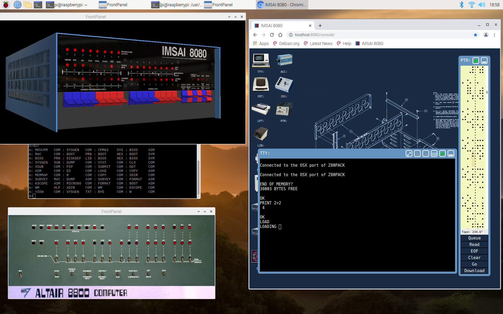
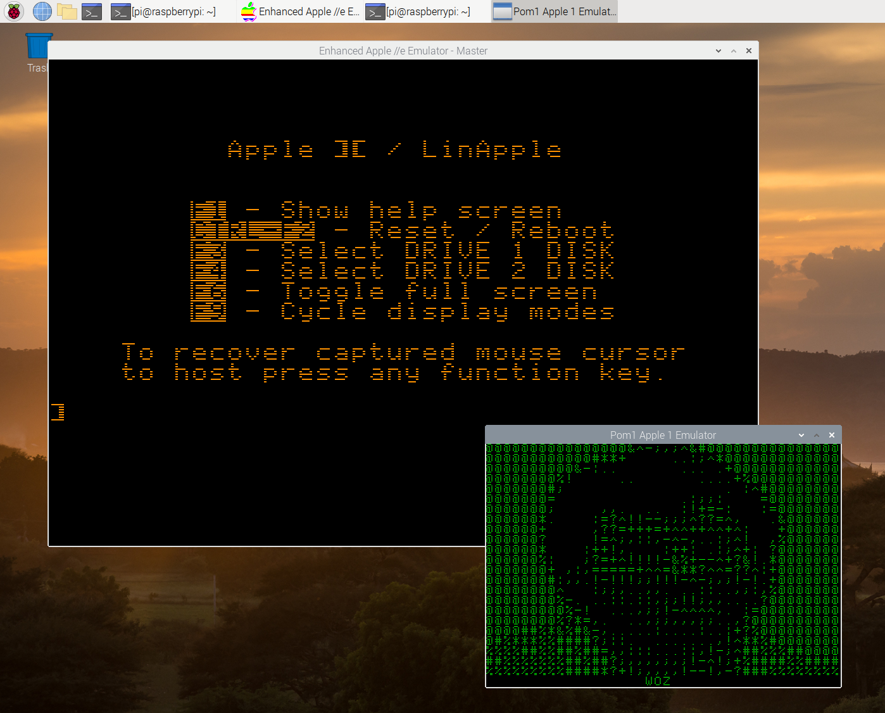
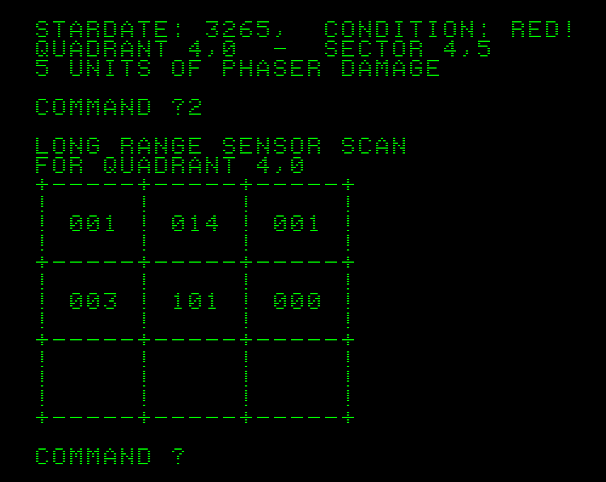
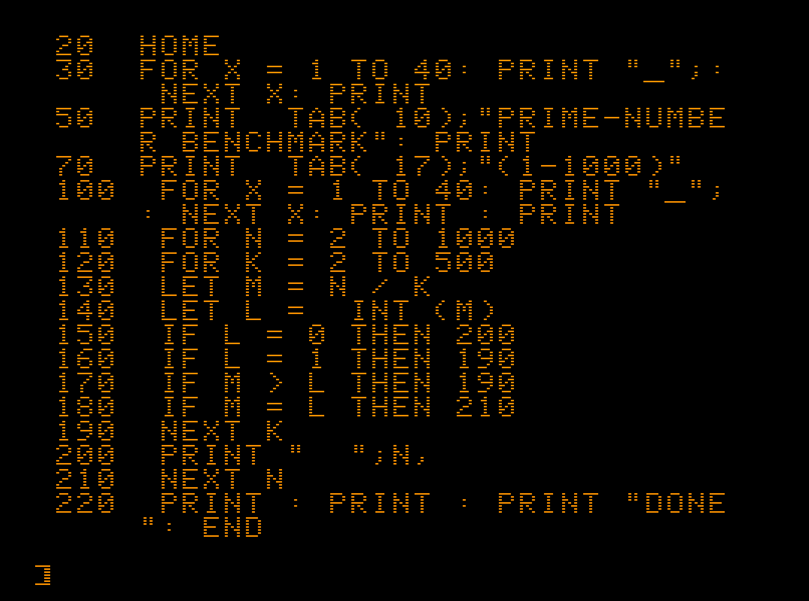

# MacintoshPi Bonus - Altair, IMSAI, Apple-1 and Apple \]\[

## Project components

This bonus part consists of the following auto-compiling and installing bash scripts for Raspberry Pi:

* Apple-1 computer emulator **[pom1](http://pom1.sourceforge.net)**.
* Apple \]\[ computer emulator **[linapple](https://linapple.sourceforge.net/screenshots.html)** supporting Apple \]\[, Apple \]\[+ , Apple //e, and enhanced Apple //e computers.
* Altair/IMSAI emulator **[z80pack](https://www.autometer.de/unix4fun/z80pack/)** supporting Altair 8800 system with 8080 or Z80 CPU, IMSAI 8080 system with 8080 or Z80 CPU, generic Z80/8080 CPU emulation, emulation of a complete system for running CP/M 1, CP/M 2, CPM 3 and MP/M 2.

This part of the MacintoshPi project runs on Raspberry Pi Zero W, Zero 2 W, 2, 2B, 3, 3B, 3A+, 3B+, 4, 400.

<p align="center"></p>


## Installation

This part of project must be installed on a clean FULL *Raspberry Pi OS (Legacy)* (with window manager) and active OpenGL drivers.

*Raspberry Pi OS (Legacy)* can be installed from the *Raspberry Pi Imager* level by selecting: *CHOOSE OS -> Raspberry Pi OS (other) -> Raspberry Pi OS (Legacy)*, *CHOOSE STORAGE -> WRITE*.

To activate the OpenGL drivers you need to run raspi-config from a terminal window.
Enter the comand: ```sudo raspi-config```
Select *Advance Options* -> *GL Driver*
You can now choose between
* Legacy - non-GL driver
* GL (Fake KMS) Desktop driver
* GL (Full KMS) Desktop driver

KMS refers to Kernel Mode-Setting, which should make the driver more efficient with better error handling. The Legacy option will revert the Raspberry Pi's back to the standard graphics driver mode. 
Select *GL (Full KMS) Desktop driver* and then OK, second OK and *Finish and Reboot*.

Then You can clone and compile retro-computers emulators:

```
git clone https://github.com/jaromaz/MacintoshPi
cd MacintoshPi/older
./apple1.sh && ./apple2.sh && ./altair-imsai.sh
```
The process of compiling and installing packages can take about 10 minutes.

The installation scripts must be run from the ```pi``` user.

<p align="center"></p>

## Start up

The following commands run individual machines:

* ```apple1``` - Apple-1
* ```apple2``` - Apple ][
* ```altair``` - Altair 8800 CP/M
* ```imsai``` - IMSAI 8080 CP/M
* ```imsaibasic``` - IMSAI 8080 Basic

## Options

### Apple-1

<p align="center"></p>

pom1 has many options to configure and utilize the emulator. They are 
accessed by Ctrl+\<letter\>. 

| Shortcut | Function                                      |
| -------- | --------------------------------------------- |
| Ctrl+F   | Switch to fullscreen or window.               |
| Ctrl+L   | Load memory from a binary or ascii file.      |
| Ctrl+S   | Save memory to a binary or ascii file.        |
| Ctrl+Q   | Quit the emulator.                            |
| Ctrl+R   | Soft reset the emulator.                      |
| Ctrl+H   | Hard reset the emulator.                      |
| Ctrl+P   | Set the pixel size (1 or 2).                  |
| Ctrl+N   | Turn scanlines on or off (pixel size 2 only). |
| Ctrl+T   | Set the terminal speed (Range: 1 - 120).      |
| Ctrl+B   | Set the cursor to blink or not.               |
| Ctrl+C   | Set the cursor to block or @.                 |

### Apple ][


<p align="center"></p>

Clicking in the LinApple window will capture the mouse. It may be
released by pressing any function key.

| Key/shortcut   | Function                                                         |
| -------------- | ---------------------------------------------------------------- |
| F1             | Show help screen.                                                |
| F6             | Toggle fullscreen mode.                                          |
| Ctrl+F2        | Cold reboot, i.e. power off and back on.                         |
| Ctrl+F10       | Hot Reset (Control+Reset)                                        |
| F12            | Quit.                                                            |
| F3             | Load disk image to slot 6 drive 1.                               |
| Alt+F3         | Load disk image to slot 6 drive 1 from FTP server.               |
| Shift+F3       | Attach hard disk image to slot 7 drive 1.                        |
| Alt+Shift+F3   | Attach hard disk image to slot 7 from FTP server.                |
| Ctrl+F3        | Eject disk image to slot 6 drive 1.                              |
| Ctrl+Shift+F3  | Eject hard disk image to slot 7 drive 1.                         |
| F8             | Save screenshot as a bitmap.                                     |
| F9             | Cycle through video modes.                                       |
| Pause          | Pause/resume emulation.                                          |
| Scroll Lock    | Toggle full speed emulation.                                     |
| Numpad +       | Increase emulation speed.                                        |
| Numpad -       | Decrease emulation speed.                                        |
| Numpad *       | Reset emulation speed.                                           |

Many disk images will boot straight into the application. Some disk
images only have files and you must find the correct application to
run. In this case you will need to execute BASIC commands to list the
files on the disk and run programs.


### Altair & IMSAI

Launching Altair or IMSAI machines first select ON and then RUN. Running IMSAI, you can switch to 3D model of this computer and open the presentation of peripherals through the site: http://localhost:8080 (1GB RAM required). 

